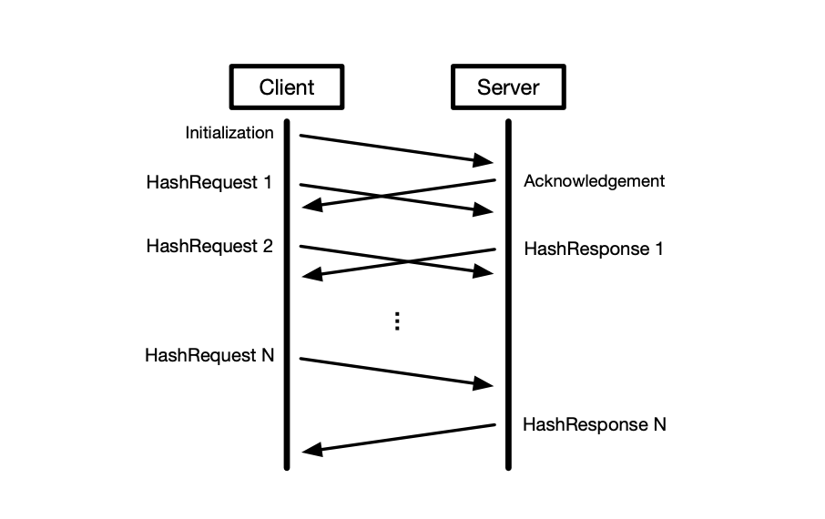

# hashing-server
Server that concurrently manages clients' files and answers with hashes of file's pieces.
Both server and client implemented in C. Implemented to work on Linux.




**Protocol:**

The protocol between the client and server will use four types of messages: Initialization, Acknowledgement, HashRequest, and HashResponse.The client starts by sending an Initialization message to the server, which informs the server of
the number of hashing requests that the client will make (denoted by the variable N). Afterwards,
the client sends N HashRequest messages to the server, where each HashRequest contains the data
segment to be hashed. The server responds to the Initialization message with an Acknowledgement, which informs the client of the total length of the response. The server responds to each
HashRequest with a HashResponse that contains the hash of the corresponding data

(Remember to make first)

To run **server**: 

```server -p <(1)> -s <(2)>```
1. -p <Number> = Port that the server will bind to and listen on. Represented as a base-10
integer. Must be specified, with a value > 1024.
2. -s <String> = Salt that the server will use in computing the hash. Represented as an ASCII
string. This is an optional argument.
  

To run **client**:


``client -a <(1)> -p <(2)> -n <(3)> --<(4)> --<(5)> -f <(6)>``
1. -a <String> = The IP address of the machine that the server is running on. Represented
as a ASCII string (e.g., 128.8.126.63). Must be specified.
2. -p <Number> = The port that the server is bound listening on. Represented as a base-10
integer. Must be specified.
3. -n <Number> = The number of HashRequests (N) that the client will send to the server.
Represented as a base-10 integer. Must be specified, and have a value ≥ 0.
4. --smin <Number> = The minimum size for the data payload in each HashRequest. Represented as a base-10 integer. Must be specified, and have a value ≥ 1.
5. --smax <Number> = The maximum size for the data payload in each HashRequest. Represented as a base-10 integer. Must be specified, and have a value ≤ 2^24.
6. -f <File> = The file that the client reads data from for all HashRequests. Must be specified,
and have enough data to support N requests at the maximum length (specified by -n and
-smax respectively).
